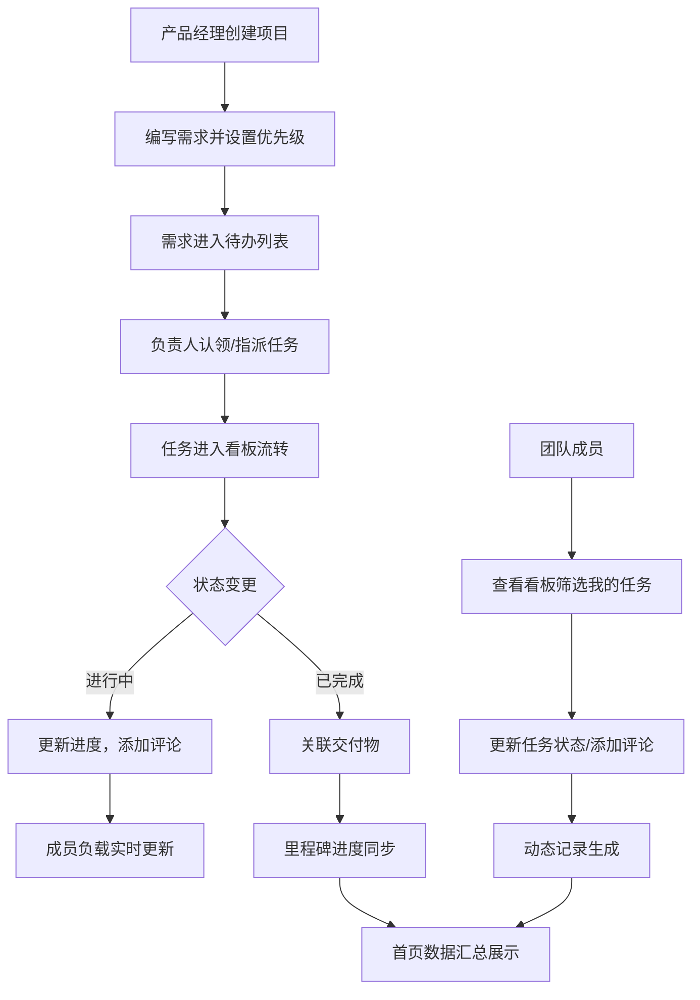

## 1. 产品概述

面向产品、设计和研发小团队的项目管理协作平台，通过统一的工作空间实现需求管理、任务流转、里程碑追踪和团队协作，解决跨角色信息不同步、进度不透明的问题。

- 核心目标：提升团队协作效率，可视化项目进度，降低沟通成本
- 目标用户：产品经理、UI/UX 设计师、前端/后端开发工程师

## 2. 核心功能

### 2.1 用户角色

| 角色 | 说明 | 核心权限 |
|------|------|----------|
| 产品经理 | 需求提出者和管理者 | 创建项目、编写需求、设置优先级、管理里程碑 |
| 设计师 | 视觉/交互设计执行者 | 认领设计任务、上传设计稿、更新任务状态 |
| 研发工程师 | 技术实现者 | 认领开发任务、更新进度、提交代码关联、评论讨论 |
| 管理员 | 项目负责人 | 全部权限、成员管理、项目配置 |

### 2.2 功能模块

1. **项目首页**：进度总览、阻塞任务、近期动态、成员负载、待确认事项
2. **需求列表**：需求创建、负责人指派、优先级设置、预计工时、截止日期
3. **看板**：拖拽状态流转、评论讨论、文件关联、变更记录、我的任务筛选
4. **里程碑**：版本目标管理、风险项追踪、交付清单、延期原因记录
5. **文件区**：文件上传、版本管理、分类标签、预览下载
6. **成员页**：团队成员列表、角色管理、任务分配视图、个人产出统计

### 2.3 页面详情

| 页面名称 | 模块名称 | 功能描述 |
|---------|---------|----------|
| 项目首页 | 项目选择器 | 切换/创建项目，展示项目基本信息 |
| 项目首页 | 进度概览卡片 | 显示整体完成率、需求数量、已完成/进行中/待开始任务数 |
| 项目首页 | 阻塞任务列表 | 高亮显示被阻塞的任务，展示阻塞原因和负责人 |
| 项目首页 | 近期动态时间线 | 按时间倒序展示任务状态变更、评论、文件上传等活动 |
| 项目首页 | 成员负载仪表盘 | 展示每位成员的任务数量分布，识别过载/空闲状态 |
| 项目首页 | 待确认事项 | 列出需要决策或确认的事项，支持一键确认 |
| 需求列表 | 需求创建表单 | 录入需求标题、描述、负责人、优先级、预计工时、截止日期 |
| 需求列表 | 需求表格视图 | 支持排序、筛选、搜索、批量操作 |
| 需求列表 | 需求详情侧栏 | 展示完整需求信息、变更历史、关联任务 |
| 看板 | 看板列 | 待开始、进行中、待测试、已完成、已取消，支持自定义 |
| 看板 | 任务卡片 | 显示标题、负责人、优先级标签、截止日期、评论数 |
| 看板 | 拖拽交互 | 卡片拖拽到不同列自动更新状态，带动画过渡 |
| 看板 | 任务详情弹窗 | 评论、关联文件、变更记录、子任务管理 |
| 看板 | 筛选器 | 按负责人、优先级、截止日期筛选，支持"我的任务"快速筛选 |
| 里程碑 | 版本卡片 | 展示版本目标、计划日期、进度条、状态标签 |
| 里程碑 | 风险项列表 | 记录风险描述、影响程度、应对措施、责任人 |
| 里程碑 | 交付清单 | 勾选式交付物列表，支持备注和附件 |
| 里程碑 | 延期原因记录 | 记录每次延期的原因、时长、审批状态 |
| 文件区 | 文件列表 | 网格/列表视图切换，按类型/时间/上传者筛选 |
| 文件区 | 文件上传 | 拖拽上传，支持多文件，进度显示 |
| 文件区 | 文件预览 | 图片、文档、设计稿在线预览 |
| 成员页 | 成员列表 | 头像、姓名、角色、加入时间、任务统计 |
| 成员页 | 个人卡片 | 点击展开查看该成员的全部任务和近期动态 |

## 3. 核心流程

**需求管理流程**：产品经理创建需求 → 设置优先级和截止日期 → 指派负责人 → 需求自动同步到看板 → 团队成员处理任务 → 状态变更触发里程碑和首页数据更新。

**协作流程**：成员查看看板筛选自己的任务 → 拖拽更新状态 → 添加评论/上传文件 → 所有操作记录到动态时间线 → 首页实时展示团队进展。

## 4. 用户界面设计

### 4.1 设计风格

- **主色调**：深蓝 `#1e40af`（专业、可信），辅以深靛蓝 `#312e81` 作为背景
- **强调色**：青绿 `#10b981`（完成/成功）、琥珀 `#f59e0b`（警告/进行中）、玫红 `#ef4444`（阻塞/风险）
- **背景主题**：深色模式为主，搭配渐变纹理和微妙噪点，营造科技感
- **字体**：标题使用 `Space Grotesk`（几何无衬线，现代感强），正文使用 `JetBrains Mono`（等宽字体，技术感和可读性兼顾）
- **按钮风格**：圆角 8px，悬停时有微妙的上浮和阴影变化，点击有按压反馈
- **布局风格**：左侧导航 + 顶部项目栏 + 主内容区的三栏布局，卡片式信息展示
- **图标风格**：线性图标 `Lucide React`，统一 16px/20px 尺寸，与文字垂直居中对齐

### 4.2 页面设计概览

| 页面名称 | 模块名称 | UI 元素 |
|---------|---------|---------|
| 项目首页 | 进度概览 | 大号百分比数字 + 环形进度条 + 数据卡片网格，渐入动画 |
| 项目首页 | 成员负载 | 横向条形图，不同颜色区分状态，hover 显示详情 |
| 项目首页 | 动态时间线 | 左侧时间轴 + 右侧内容卡片，新条目从右侧滑入 |
| 需求列表 | 数据表格 | 斑马行 + 悬停高亮，表头固定，支持列宽调整 |
| 需求列表 | 创建表单 | 模态弹窗，分区布局，实时校验，提交后渐隐 |
| 看板 | 看板列 | 浅灰背景 + 深色标题栏，列之间有细微分隔线 |
| 看板 | 任务卡片 | 白色卡片 + 细微阴影，拖拽时放大 + 投影加深 |
| 看板 | 优先级标签 | 左边缘彩色条，高优红色、中优琥珀、低优青绿 |
| 里程碑 | 版本卡片 | 卡片顶部彩色条带，内部进度条，状态徽章右上角 |
| 里程碑 | 风险矩阵 | 4x4 网格，按影响/概率分布，hover 显示详情 |
| 文件区 | 文件网格 | 圆角缩略图，选中状态有边框高亮 |
| 成员页 | 个人卡片 | 头像 + 姓名 + 角色标签，点击展开详情面板 |

### 4.3 响应式

- **Desktop-first**：默认 1280px+ 最佳体验，主内容区最大宽度 1440px
- **平板适配**（1024px）：左侧导航收起为图标模式，看板列支持横向滚动
- **移动适配**（768px）：底部 Tab 导航，看板改为单列表视图，卡片垂直堆叠
- **触控优化**：最小点击区域 44x44px，拖拽有触觉反馈提示，滚动惯性流畅

### 4.4 动效设计

- **页面加载**：顶部进度条 + 内容区块 staggered 渐入（80ms 间隔）
- **卡片拖拽**：抬起时 scale(1.02) + box-shadow 加深，放下时弹性缓动
- **状态变更**：原位置淡出，新位置淡入 + 轻微向上位移
- **侧边栏展开**：宽度过渡 + 内容 fade-in，200ms ease-out
- **按钮交互**：hover 时 translateY(-1px) + 阴影，active 时 translateY(0)
- **通知提示**：从顶部滑入，停留 3s 后滑出，支持手动关闭
