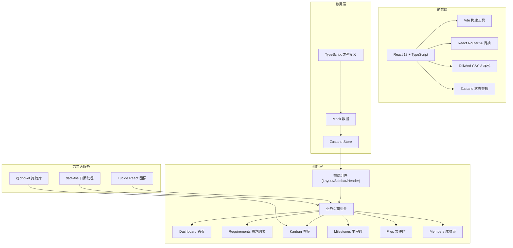
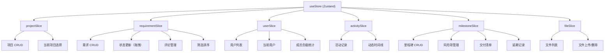
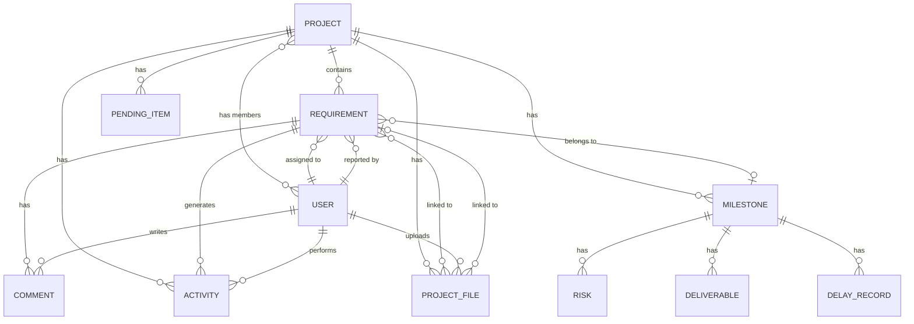

## 1. 架构设计



## 2. 技术描述

- **前端框架**：React@18 + TypeScript@5 + Vite@5
- **构建工具**：Vite 5.x，使用 React SWC 插件获得更快的编译速度
- **路由方案**：React Router v6，使用 createBrowserRouter 实现嵌套路由
- **状态管理**：Zustand 4.x，轻量级状态管理，支持 devtools 和持久化
- **样式方案**：Tailwind CSS 3.4.x，自定义主题配置
- **图标库**：Lucide React，统一线性图标风格
- **拖拽库**：@dnd-kit/core + @dnd-kit/sortable，实现看板拖拽功能
- **日期处理**：date-fns，轻量级日期工具库
- **数据方案**：全量 Mock 数据，使用 TypeScript 接口定义数据模型，无需后端

## 3. 路由定义

| 路由路径 | 页面组件 | 说明 |
|---------|---------|------|
| `/` | `Navigate` to `/projects/1/dashboard` | 根路径重定向到默认项目首页 |
| `/projects/:projectId/dashboard` | `Dashboard` | 项目首页，汇总进度和动态 |
| `/projects/:projectId/requirements` | `Requirements` | 需求列表页 |
| `/projects/:projectId/kanban` | `Kanban` | 看板页，拖拽管理任务 |
| `/projects/:projectId/milestones` | `Milestones` | 里程碑管理页 |
| `/projects/:projectId/files` | `Files` | 文件区 |
| `/projects/:projectId/members` | `Members` | 成员管理页 |
| `*` | `NotFound` | 404 页面 |

## 4. API 定义（Mock 数据层）

```typescript
// 项目
interface Project {
  id: string;
  name: string;
  description: string;
  icon: string;
  color: string;
  createdAt: string;
}

// 用户
interface User {
  id: string;
  name: string;
  avatar: string;
  role: 'product' | 'designer' | 'developer' | 'admin';
  email: string;
}

// 需求/任务
interface Requirement {
  id: string;
  projectId: string;
  title: string;
  description: string;
  status: 'todo' | 'in-progress' | 'testing' | 'done' | 'cancelled';
  priority: 'low' | 'medium' | 'high' | 'urgent';
  assigneeId: string | null;
  reporterId: string;
  estimatedHours: number;
  spentHours: number;
  dueDate: string | null;
  createdAt: string;
  updatedAt: string;
  tags: string[];
  milestoneId: string | null;
  blocked: boolean;
  blockReason: string | null;
}

// 评论
interface Comment {
  id: string;
  requirementId: string;
  userId: string;
  content: string;
  createdAt: string;
}

// 变更记录
interface Activity {
  id: string;
  projectId: string;
  type: 'status-change' | 'comment' | 'file-upload' | 'assignment' | 'milestone';
  userId: string;
  requirementId: string | null;
  description: string;
  metadata: Record<string, any>;
  createdAt: string;
}

// 里程碑
interface Milestone {
  id: string;
  projectId: string;
  name: string;
  description: string;
  targetDate: string;
  actualDate: string | null;
  status: 'planning' | 'in-progress' | 'delayed' | 'completed';
  progress: number;
  version: string;
}

// 风险项
interface Risk {
  id: string;
  milestoneId: string;
  description: string;
  impact: 'low' | 'medium' | 'high' | 'critical';
  probability: 'low' | 'medium' | 'high';
  mitigation: string;
  ownerId: string;
  status: 'open' | 'mitigated' | 'resolved';
}

// 交付清单
interface Deliverable {
  id: string;
  milestoneId: string;
  name: string;
  description: string;
  completed: boolean;
  completedAt: string | null;
  attachmentUrl: string | null;
}

// 延期记录
interface DelayRecord {
  id: string;
  milestoneId: string;
  reason: string;
  delayDays: number;
  newTargetDate: string;
  approvedBy: string | null;
  createdAt: string;
}

// 文件
interface ProjectFile {
  id: string;
  projectId: string;
  name: string;
  size: number;
  type: string;
  url: string;
  uploadedBy: string;
  uploadedAt: string;
  tags: string[];
  requirementId: string | null;
}

// 待确认事项
interface PendingItem {
  id: string;
  projectId: string;
  title: string;
  description: string;
  type: 'decision' | 'approval' | 'feedback';
  createdBy: string;
  createdAt: string;
  dueDate: string | null;
}
```

## 5. Store 架构



## 6. 数据模型

### 6.1 ER 图



### 6.2 Mock 数据初始化

```typescript
// 初始 Mock 数据配置
const mockData = {
  users: [
    { id: 'u1', name: '张明', role: 'product', avatar: 'https://...' },
    { id: 'u2', name: '李华', role: 'designer', avatar: 'https://...' },
    { id: 'u3', name: '王芳', role: 'developer', avatar: 'https://...' },
    { id: 'u4', name: '陈强', role: 'developer', avatar: 'https://...' },
    { id: 'u5', name: '赵雪', role: 'admin', avatar: 'https://...' },
  ],
  projects: [
    { 
      id: 'p1', 
      name: '智能客服系统 V2.0', 
      description: '新一代智能客服平台，支持多渠道接入和AI智能问答',
      icon: 'message-square',
      color: '#3b82f6'
    },
  ],
  requirements: [
    {
      id: 'r1',
      projectId: 'p1',
      title: '用户登录模块重构',
      description: '重构现有登录系统，支持手机号、邮箱、第三方登录',
      status: 'in-progress',
      priority: 'high',
      assigneeId: 'u3',
      reporterId: 'u1',
      estimatedHours: 24,
      spentHours: 12,
      dueDate: '2026-06-20',
      tags: ['核心功能', '安全'],
    },
    // 更多需求...
  ],
  // 更多数据...
};
```

## 7. 目录结构

```
src/
├── components/          # 通用组件
│   ├── Layout/         # 布局组件
│   ├── ui/             # 基础 UI 组件
│   └── features/       # 业务组件
├── pages/              # 页面组件
│   ├── Dashboard/
│   ├── Requirements/
│   ├── Kanban/
│   ├── Milestones/
│   ├── Files/
│   └── Members/
├── store/              # Zustand stores
├── types/              # TypeScript 类型定义
├── data/               # Mock 数据
├── hooks/              # 自定义 Hooks
├── utils/              # 工具函数
├── App.tsx
├── main.tsx
└── index.css
```
